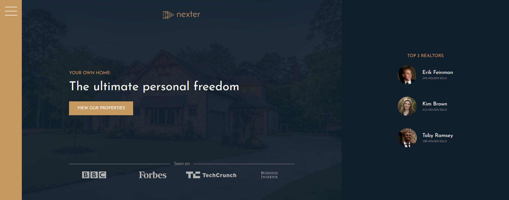

# Nexter Project - Udemy CSS Course

## Description

This repository contains the **Nexter project**, developed as part of [Advanced CSS and Sass: Flexbox, Grid, Animations and More!](https://www.udemy.com/course/advanced-css-and-sass/) on Udemy. Nexter is a modern real estate website showcasing beautiful homes, built using advanced CSS techniques and layout design principles.

## Features

- **Responsive Design**: Nexter is fully responsive, optimized for various screen sizes, from mobile devices to large desktops.
- **Grid Layouts**: The website utilizes CSS Grid for advanced and flexible layout options.
- **CSS Animations**: Smooth transitions and animations are implemented to enhance user experience.
- **Modern Aesthetics**: Clean and elegant design using the latest CSS features, such as custom properties, Flexbox, and Grid.
- **Scalable Architecture**: The project structure follows the BEM (Block Element Modifier) methodology for scalable and maintainable code.

## Technologies Used

- HTML5 and CSS3 for building and styling the website.
- Advanced CSS techniques, including Grid and Flexbox for layout.
- Sass (SCSS) for more efficient and structured styling.
- Responsive design for mobile-first development.

## Getting Started

To view the Nexter project, clone this repository to your local machine and open the `index.html` file in your web browser. Ensure that Sass is installed if you plan to make any changes to the SCSS files.

## Project Structure

The project has a well-organized structure:

- `index.html`: The main HTML file for the website.
- `css/style.css`: The compiled CSS file for styling the user interface.
- `sass/`: Directory containing the Sass (SCSS) files for styling.
- `img/`: A directory containing images used in the project.

## Credits

The Nexter project was created as part of [Advanced CSS and Sass: Flexbox, Grid, Animations and More!](https://www.udemy.com/course/advanced-css-and-sass/) on Udemy, instructed by [Jonas Schmedtmann](https://www.udemy.com/user/jonasschmedtmann/). The design, code, and layout principles are based on the course content.
